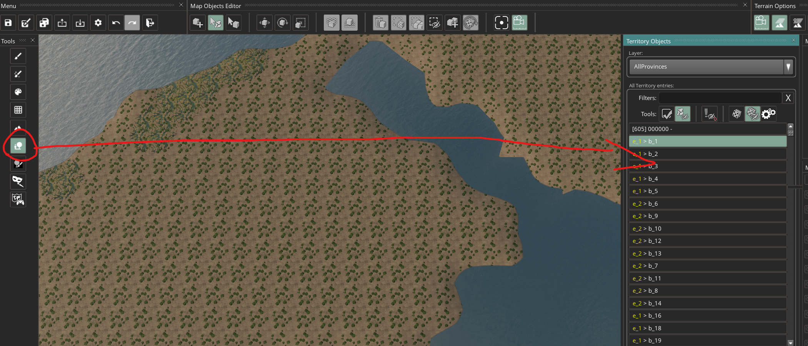
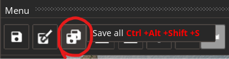

# AzgaarToCK3
## Installation
- Download latest release and extract it to any folder
- Subscribe to "Total Conversion Sandbox" mod on workshop

## Usage
1. Generate a map via https://azgaar.github.io/Fantasy-Map-Generator/
2. Export GeoJSON cells and JSON full

3. Place these files in the extracted folder
4. Run the .exe file
5. Follow the instructions
6. Go to properties of CK3 in Steam and add "-mapeditor" parameter
7. Launch the game making sure the newly created mod is added to the playset and enabled
8. Repack heightmap

10. Go to Map Objects Editor. Click on any territory in the list and select all with Ctrl+A hotkey

11. Click on Automatically place... button

12. Some of the territories failed to add locators properly. Click on Filter all entries that contain errors

13. Repeat 10-12 until there are no entries with errors
14. If some entries won't fix themselves select the entry, check what object fails and click on Configure Autonudge... button.

Then find settings related to that type of object and tweak them then retry 10-12.
Usually changing some distance parameters helps.
If that still did not help then select the object and move it by hand.
Hopefully there not many of them.
15. Save all and exit (Alt+F4 if it restarts the game instead of exit)

16. Remove -mapeditor launch option and run the game
17. Enjoy!