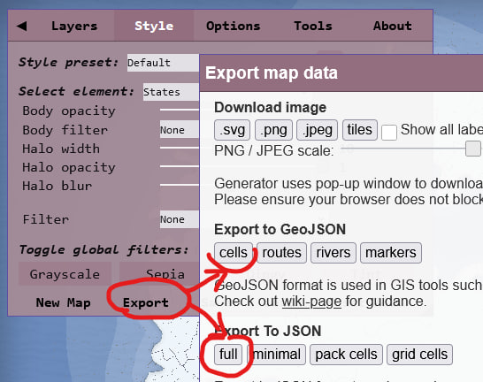
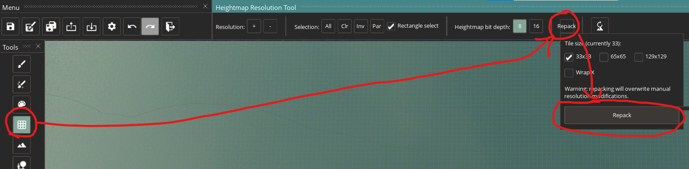
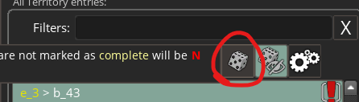
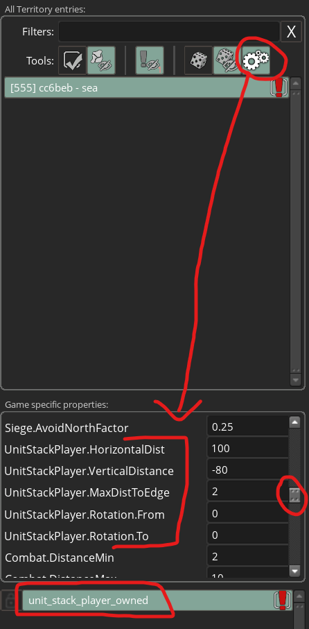

# Azgaar's Fantasy Map Generator to Crusader Kings III
## Installation
- Download the latest release and extract it to any folder
- Subscribe to [Total Conversion Sandbox](https://steamcommunity.com/sharedfiles/filedetails/?id=2524797018) mod on the workshop

Supported game version: `1.12.4`

## Quirks
- Azgaar only has 2 titles and CK3 has 5:
	- barony = province
	- county = 4 neighboring provinces of the same state
	- duchy = state
	- kingdom = all duchies of the same dominant culture
	- empire = all kingdoms of the same dominant religion
- Biome to terrain conversion is complicated and is WIP.
- Detached single cell parts of provinces are reassigned to neighboring provinces.
- Single cell provinces are deleted as it is not possible to put locators inside due to small size.
- Dynasties are randomized based on basenames. They can repeat.
- No heads of religion.
- Holy sites are mapped to random provinces/counties.
- Characters are created and assigned titles randomly. They may have too many domains which they will give out after unpausing.
- Cultures are mapped to random existing cultures.
- Religions are mapped to random existing religions.
- Rivers are not generated.

## Known issues
- Water provinces are rarely convex. It means that ship routes will look like navigators are all drunk.
- Map painting is not perfect.

## Multiplayer
- use [[UMMS]Ultimate Modded Multiplayer Solver:null checksum](https://steamcommunity.com/sharedfiles/filedetails/?id=3227254722) mod
- use [IronyModManager](https://bcssov.github.io/IronyModManager/) to export the playset with the custom mod and friends should import the exported file

## Usage
1. Generate a map via https://pryvyd9.github.io/Fantasy-Map-Generator/ (It is a special version for better conversion)
2. Export GeoJSON cells and JSON full

3. Place these files in the extracted folder
4. Rename json and geojson files to input.json and input.geojson
5. Run `ConsoleUI` file
6. Follow the instructions
7. Go to properties of CK3 in Steam and add `-mapeditor` parameter
8. Launch the game making sure the newly created mod is added to the playset and enabled
9. Map Editing:
    1. Repack heightmap
		
	2. Go to Map Objects Editor. Click on any territory in the list and select all with Ctrl+A hotkey
		
	3. Click on `Automatically place...` button
		
	4. Some of the territories failed to add locators properly. Click on Filter all entries that contain errors
	    
	5. Repeat 10-12 until there are no entries with errors
	6. If some entries won't fix themselves select the entry, check what object fails and click on `Configure Autonudge...` button.
	    
	Then find settings related to that type of object and tweak them then retry 10-12. Usually changing some distance parameters helps. If that still did not help then select the object and move it by hand. Hopefully there not many of them.
	7. Make any other changes in map editor.
	8. Save all and exit (Alt+F4 if it restarts the game instead of exit)
	    
10. Remove -mapeditor launch option and run the game
11. Enjoy!

## More Usage
- You can delete the `settings.json` to reconfigure everything or edit `settings.json` to suit your needs
